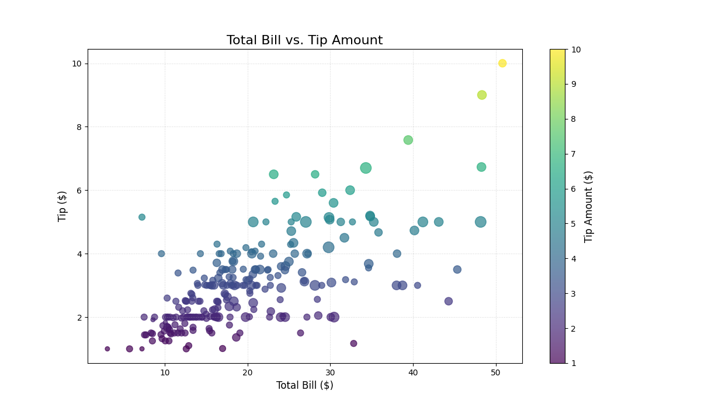
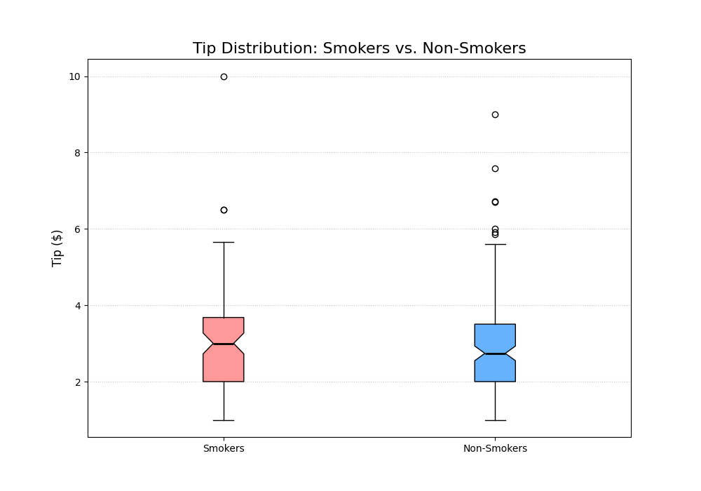

# Python Data Visualization with Matplotlib & Seaborn

A data science portfolio project demonstrating in-depth data visualization and exploratory data analysis (EDA) using Python's Matplotlib and Seaborn libraries. This project analyzes the "Tips" and "Iris" datasets to uncover patterns and relationships.

## 📋 Table of Contents

- [About The Project](#about-the-project)
- [Project Visuals](#project-visuals)
- [Key Insights](#key-insights)
- [Technologies Used](#technologies-used)
- [How To Run](#-how-to-run)

## About The Project

This repository contains Python scripts that perform a comprehensive exploratory data analysis (EDA) on two classic datasets:

1.  **The 'Tips' Dataset:** Records of tips, total bill, and customer information from a restaurant.
2.  **The 'Iris' Dataset:** Measurements of sepal and petal dimensions for three species of iris flowers.

The primary goal is to showcase a strong understanding of Matplotlib's features, from basic plots (lines, scatters) to complex, multi-plot dashboards (subplots), and to derive meaningful insights from the data.

## 📊 Project Visuals

Here are some of the key visualizations generated by the analysis.

### 'Tips' Dataset Analysis

This dashboard provides a comprehensive overview of the restaurant tips data at a single glance.


#### Individual Plot Examples:

| Scatter Plot: Bill vs. Tip | Bar Chart: Average Tip by Day |
| :---: | :---: |
|  |  |

| Histogram: Bill Distribution | Box Plot: Smoker vs. Non-Smoker Tips |
| :---: | :---: |
|  |  |

## 💡 Key Insights

The visualizations led to several key insights:

### 'Tips' Dataset
* **Bill vs. Tip Correlation:** There is a strong, positive linear relationship between the `total_bill` and the `tip` amount. As the bill increases, the tip increases.
* **Day of the Week:** Tips are, on average, higher on weekends (Sunday & Saturday) compared to weekdays.
* **Party Size:** Larger parties (`size`) tend to have higher total bills and, subsequently, higher tips.
* **Smoker Impact:** While the median tip is similar for smokers and non-smokers, the distribution for non-smokers has more high-end outliers (a few very generous tippers).

### 'Iris' Dataset
* **Species Separation:** The 'Setosa' species is clearly distinct and linearly separable from the 'Versicolor' and 'Virginica' species based on its petal and sepal measurements.
* **Feature Relationships:** `petal_length` and `petal_width` are strongly correlated, indicating that as petals get longer, they also get wider.

## 🛠️ Technologies Used

* **Python 3.x**
* **Pandas:** For data loading and manipulation.
* **Matplotlib:** For creating all core plots and customizations.
* **Seaborn:** For loading datasets and for high-level plots (like the initial box plot).
* **Numpy:** For numerical operations.

## 🚀 How To Run

To run this analysis on your local machine, follow these steps:

1.  **Clone this repository:**
    ```bash
    git clone [https://github.com/YourUsername/YourRepoName.git](https://github.com/YourUsername/YourRepoName.git)
    ```

2.  **Navigate to the project directory:**
    ```bash
    cd YourRepoName
    ```

3.  **Install the required libraries:**
    (It's recommended to do this in a virtual environment)
    ```bash
    pip install pandas matplotlib seaborn numpy
    ```

4.  **Run the Python analysis scripts:**
    (Assuming you saved the code as `tips_analysis.py` and `iris_analysis.py`)
    ```bash
    python tips_analysis.py
    python iris_analysis.py
    ```
    This will run the code and save the visualization images (like `tips_dashboard.png`) to the project folder.
